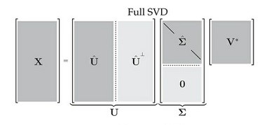
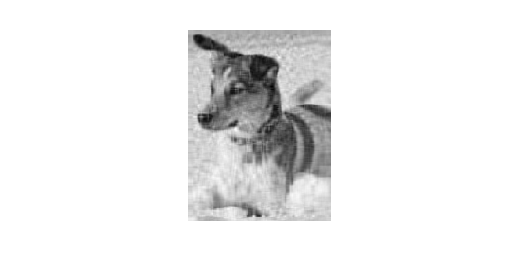

```{r setup, include=FALSE}
knitr::opts_chunk$set(echo = TRUE)
```

```{r libraries, include=FALSE}
# R libraries
library(dplyr)
library(kableExtra)

# Python libraries
library(reticulate)

# create a new environment 
#conda_create("r-reticulate")
# install SciPy
#conda_install("r-reticulate", "matplotlib", "numpy")

# import SciPy (it will be automatically discovered in "r-reticulate")
#matplotlib <- import("matplotlib")
#numpy <- import("numpy")
#os <- import("os")
```
### Introduction 

How to decide on a cut-off rank in noisy data

### A brief overview

Single Value Decomposition (SVD) is one of the most popular matrix decompositions taught to students, as it among the fundamental matrix equation used in the areas of engineering, financial sector, and computer science, and many more. It is the base mathematical formula for the well-known clustering technique: Principle Component Analysis (PCA). 

### PCA and SVD - Contrasting equations.

Any student or professional learning tools for computer science, statistics or mathematics can appreciate that knowing how each function works is vitally important to produce a satisfactory result. The intention here is to highlight the difference general difference between two standard tools used in the analysis. 

In calculating the Principal Component Analysis, the analyst needs to scale and centre the matrix to a mean of zero and unity variance before applying the Singular Value Decomposition [@brunton_data-driven_2019].  Thus, for Singular Value Decomposition, it is NOT necessary to centre, scale or square root the data; therefore, the data is in its original form. 

Since the Principle Component Analysis relies on the same equation, that being the Singular Value Decomposition, it is fair to assume that both methods aim to find the rank of independence, and thus the correlating effects between two or more independent variables.


### Why Singular Value Decomposition? 

Sadek, 2012 [@sadek_svd_2012] describes the purpose of Singular Value Decomposition when stating, "SVD is a stable and an effective method to split the system into a set of linearly independent components, each of them bearing own energy contribution".  Where the "energy" is, in fact, the descending correlating effect on each rank, which could be best described as independent variables.  As such, the first rank correlates the strongest, and so forth, reducing in effect at a rate based solely on the composition of the initial matrix.

The outcome of the SVD is ranked independent components by correlation, which intrinsically aligns with a clustering and dimension reduction problem, due to the simple fact that only a certain number of featured ranks needed to reproduce an approximation of the original matrix [@ranade_variation_2007] [@sadek_svd_2012] [@brunton_data-driven_2019].

### Understanding the equation.

The Singular Value Decomposition made up of three unitary components, extracted from a matrix, which for this example, the matrix $A$ in the space of real numbers, $A\in R^{m x n}$. The three unitary components $U, \Sigma, V$ matrices extracted from $A$ to form three distinctly shaped portions, where both $U$ and $V$ at the vector level are $u_{k}$ and $v_{k}$ respectively. The $\Sigma$, in this case, is sigma and is denoted as $\sigma_{k}$ in its vector form. Together they form a low-ranked matrix $\hat{X} = \hat{U}\hat{\Sigma}\hat{V}^{T}$ :

$$\hat{X}=\sum_{k=1}^{r} \sigma_{1}u_{1}v_{1}^{T} + \sigma_{2}u_{2}v_{2}^{T} + \sigma_{r}u_{r}v_{r}^{T}$$

So the output of a full SVD produces a left singular value, $U^{nxn}$, singular values, $\Sigma^{mxn}$, and right singluar values, $V^{mxn}$, where each $r$ is the rank or column vector of $k$, which produce unitary matrix such that all components have a transpose and an inverse of itself. The breakdown of each component can be seen in _Figure 1._

 
<center> _Figure 1_ - Components of the full SVD.<br><br> </center>  

The term unitary matrix denotes that each of the components has a transpose and an inverse of itself.  The result is a low-ranked approximation of $A$, which is known as $\hat{X}$, with the reason being that the multiplication of $U, S,$ and $V$ produces a close resemblance to the original matrix, and therefore, is not $A$ [@brunton_data-driven_2019].  The advantage of the separation of components to form a low-ranked matrix, $\hat{X}$ allows the user to specify the number of ranks, columns,  of each component of $U, V,$ and $\Sigma$ to include in the reconstruction of $A$.   For instance, a person may extract one or many ranks to achieve the best outcome.  Defining the number of ranks, threshold, is particularly important and the basis for this article.  

In general, there is no stipulation as to the type of matrix needed to perform Singular Value Decomposition. As such, there is no need to test for symmetry, rank testing or the presence of positive Eigenvalues and Eigenvectors before applying the equation [@singh_linear_2013]. 

However, this is not entirely true, as both SVD and PCA assume linearity within the dataset, as each segment is drawn sagaciously from the Eigenvalue and Eigenvector problem.  Meaning each of the values above sits on a line-span, can undergo a linear transformation, is bound by the constraints of linear algebra and as a consequence is a linear regression calculation [@gundersen_singular_2018]. Whereby the sigma values, $\Sigma$ become the positive square root of each Eigenvalue $\lambda_{i} = \sigma^{2}_{i}$, and the Eigenvectors metamorphosised into the column vectors of $V$ both of which are determined by the matrix transpose of itself $A^{T}A$. Conversely, the matrix multiplication of the transpose $AA^{T}$ produces the $U$ component [@noauthor_singular_2011][@gundersen_proof_2018].  Therefore, it would be fair and reasonable to first determine the normality of the dataset before performing either the Principal Component Analysis or Singular Value Decomposition.

If there is only one main point you take from this section is that both SVD and PCA provide a linear transformation where each of the matrices ordered in descending order.  As such, each column of the matrix $U$ and $\Sigma$ transform from the matrix $A$ produces an order column vector, which ranks from left to right; strongest to weakest. Whereas, the right singular values of $V^{T}$ also produce from $A$ is also in descending order. Note though, $V$ in in transpose position and is in a read from top-down fashion from most correlated to weakest row vectors.  


For a more detailed visual explanation of linear algebra fundamentals, linear transformation and the intuition behind how the Eigenvectors and Eigenvalues remain on the line span, then see the videos by Sanderson, 2016 [@sanderson_eigenvectors_2016][@sanderson_vectors_2016];  

* [Vectors, what even are they? | Essence of linear algebra, chapter 1](https://www.youtube.com/watch?v=fNk_zzaMoSs&list=PLZHQObOWTQDPD3MizzM2xVFitgF8hE_ab)
* [Eigenvectors and eigenvalues | Essence of linear algebra, chapter 14](https://www.youtube.com/watch?v=PFDu9oVAE-g)


### Supervised approach to SVD.

To appreciate the power of the Singular Value Decomposition and how vital the concept of rank is in influencing how the analysis utilises this transformation, it is best first to visualise the changes in a supervised manner.  In the following example, the oython code and image is taken directly from Brunton and Kutz, 2019 and altered slightly to reflect the needs of the article, and can be downloaded from the authors websites [databookuw](databookuw.com)[@brunton_steven_l_about_nodate].

```{python eval=FALSE, include=FALSE}
from matplotlib.image import imread
import matplotlib.pyplot as plt
import numpy as np
import os
plt.rcParams['figure.figsize'] = [16, 8]


A = imread('images/dog.jpg')
A = np.mean(A, -1); # Convert RGB to grayscale


img = plt.imshow(A)
img.set_cmap('gray')
plt.axis('off')
np.savetxt("test.csv", A[1:10], delimiter=",")
plt.savefig("images/grey_dog.png")
Asize = os.path.getsize("images/grey_dog.png")
plt.title("Original: Shape " + str(A.shape) + " & Size " + str(Asize/1000) + "KB")
plt.show()
```
<center> _Code Snippet 1 - Importing image and setting to grey scale._<br><br> </center>

<center> _Figure 2 - Greyscaled image._<br><br> </center>  

At this stage, in _Code Snippet 1_ not a lot has happened, the image of the dog has been read, converted to a grey scaled image instead of a colour photo and assigned to the variable A (See _Figure 2_).  Behind the scenes, the matrix is $A^{2000x1500}$ filled with real values from 0-255, which is the result of the conversion to greyscale. 

The _Table 1_ below represents a small portion of the matrix containing 2000 rows by 1500 columns!  The Singular Value Decomposition object is to move these values into the highest rank columns $U$ and $\Sigma$ and rows, remember the $V$ component is in transpose so that the matrix still contains the essential information necessary for the picture to still be recogniseable for what it is, an image of the dog.  Yet, the number of columns, and rows can be dramatically reduced the number of dimensions required to yield a similar outcome to the original image.  


```{r echo=FALSE, results='axis'}
pixels.table = read.csv("ninexnine.csv")
colnames(pixels.table) <- c("A1", "A2", "A3", "A4", "A5",
                            "A6", "A7", "A8", "A9")

pixels.table[1:9] %>%
  kable() %>%
  kable_styling()
```
<center> _Table 1 - 9 x 9 pixels from greyscaled dog._<br><br> </center>

The following code snippet holds the SVD function used to split the original image.  Here the total rank of $U$ is multiplied by the specific number of columns from $\Sigma$ and rows of $R$ to produce $\hat{X}=U\hat{\Sigma}\hat{R^{T}}$ where the \hat{} represents the absolute difference of $|\hat{R^{T}}-R^{T}|$ and $|\hat{\Sigma}-\Sigma|$ and is know as the least squared formula. 


```{python eval=FALSE, include=FALSE}
# Perform full matrix SVD using numpy.linalg.svd 
U, S, VT = np.linalg.svd(A,full_matrices=False)
S = np.diag(S)


# Create the X using all ranks of U, S, VT.
# Use library os and the function getsize to determine the total number of kilo bytes of # the full image.
X = U @ S @ VT
img = plt.imshow(X)
img.set_cmap('gray')
plt.axis('off')
plt.savefig('images/Xfull_dog.png')
Xsize = os.path.getsize("images/Xfull_dog.png")
plt.title("Reconstituded X: Shape " + str(X.shape) + " & Size " + str(round(Xsize/1000,2)) + " KB")
plt.show()
```

Reconstituting the image is as simple as taking the dot product of the component U, S, RT in that order, _Code Snippet 2_, in what is know as Truncated Singular Value Decomposition (TSVD).  The idea is to stop when the image is similar to the original image. In this case, specific ranks can isolate the best-reconstructed image and is the concept behind this being a supervised SVD. 


```{python eval=FALSE, include=FALSE}
# Uses a loop to create three pictures with rank 5, 20, 100. 
fig_count = 0
for r in (5, 20, 100):
    # Construct approximate image
    Xapprox = U[:,:r] @ S[0:r,:r] @ VT[:r,:]
    
    
    # Create Figure Number using fig_count grab the image of X, show it 
    # using greyscale with plot axis removed. Increase the fig_count.
    plt.figure(fig_count + 1) 
    img = plt.imshow(Xapprox) 
    img.set_cmap('gray')     
    plt.axis('off')
    fig_count = fig_count + 1 
    
    
    # Create the filename, save the file as image then get file size in Bytes.
    filename = "X rank " + str(r)
    plt.savefig('images/' + filename + ".png")
    Xsize = os.path.getsize("images/" + filename + ".png")
    
    
    # Finally, create a title and show the individual image file.
    plt.title(filename + ": Shape " + str(X.shape) + " & Size " +
              str(round(Xsize/1000,2)) + " KB")
    plt.show()
```
<center> _Code Snippet 2 - Truncate Singular Value Decomposition._<br><br> </center>
   |  
:-------------------------:|:-------------------------:
X rank 5 - Size 89 KB      |   X rank 20 - Size 116 KB


  |   
:--------------------------:|:-------------------------:
X rank 100 - Size 175 KB    | Original image - Size 214 KB

<center> _Figure 3 - Original versus ranked recontructed images._<br><br> </center>

The four images in _Figure 3_ show the difference between the original image $A$ and that of $\hat{X}$ at rank 100 that is the product of $U$ and the first 100 columns of $\hat{S}$ and $\hat{R^{T}}$, and at 20% reduction in memory allocation.  The size reduction may not initially seem that much. However, when dealing with a massive matrix in the millions, it can easily be seen that any saving in memory can be crucial in saving time. More importantly, though, the key components have been drawn out through this transformation to yield the same effect by ordering the singular values in a way that is easy to manage even for the most novice analyst.

### References