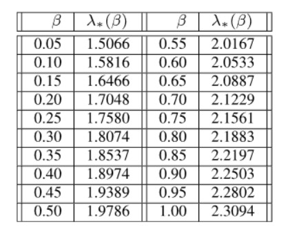
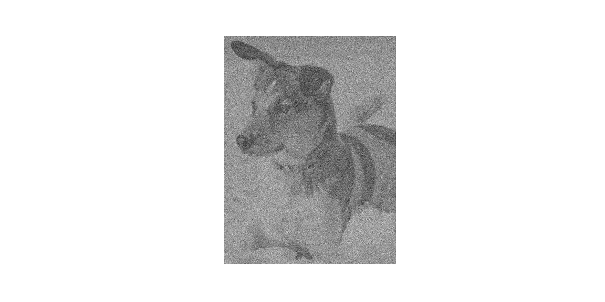
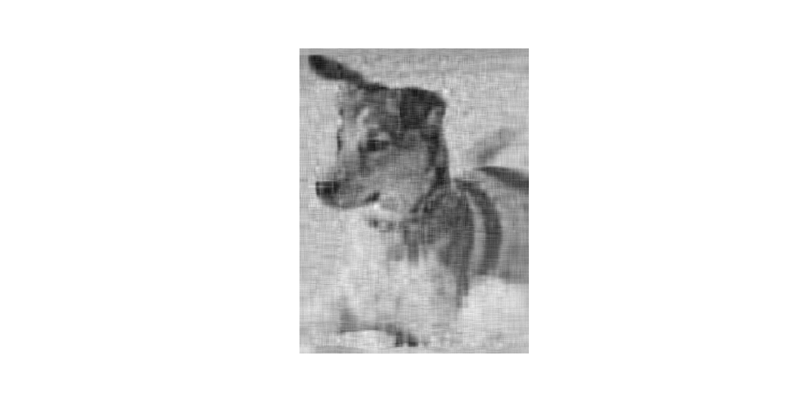

```{r setup, include=FALSE}
knitr::opts_chunk$set(echo = TRUE)
```

```{r libraries, include=FALSE}
# R libraries
library(dplyr)
library(kableExtra)

# Python libraries
library(reticulate)

# create a new environment 
#conda_create("r-reticulate")
# install SciPy
#conda_install("r-reticulate", "matplotlib", "numpy")

# import SciPy (it will be automatically discovered in "r-reticulate")
#matplotlib <- import("matplotlib")
#numpy <- import("numpy")
#os <- import("os")
```

### Introduction - How to decide on a cut-off rank in noisy data?

In this article, the aim is to showcase the work of Gavish and Donoho [@gavish_optimal_2014] in finding a cut-off rank in data containing gaussian noise.  Though a majority of the python code is taken and at times edited from the book by Bruton & Kutz, [@brunton_data-driven_2019] the inspiration behind this post comes directly from reading this book found at [data driven science](http://databookuw.com/).  Alternatively, the  Youtube series covering the book material is available at [Seve Brunton - Youtube channel](https://www.youtube.com/channel/UCm5mt-A4w61lknZ9lCsZtBw). Nevertheless, this would not be possible without the introduction to this topic by the Data Science team at [James Cook University](www.jcu.edu.au).  


### Unsupervised approach - A new approach for thresholding.


At the heart of this demonstration is white Gaussian noise. To understand what makes white noise troublesome comes down to the way independent and identically distributed dataset work. If there are two datasets, same size, both are symmetrical and independent and identically distributed matrices. The matrix $X$ in this scenario is the actual matrix, and the other matrix consist of $Y= X + \sigma*{Z}$ where $\sigma*{Z}$ is the standard deviation by the random numbers generated in the form of a normal distribution. Both of these matrices have the same probability that both samples $X$ and $Y$ come from the same population mean $\mu$, call it $B$, such that $x_{i},y_{i} \in B$,  then both are within the same distribution along a "homogenous" Markov Chain [@takacs_distribution_1970]. The best way to visualise this is to think of all the dimensions being lay flat in a line, then it is easy to understand how the noise can become hidden in the population of this one dimensions array. Despite belonging to the same population, they do not have the same standard deviation $Y$ is now double the standard deviation of $X$ due to the artificial introduction of noise via the product of $X + \sigma*{Z}$. Therefore, $\sigma/2$ can be used counters this effect. With that in mind, the Truncated SVD can be re-introduced to provide a possible solution to this tricky problem. 


In 2014, Gavish and Donoho [@gavish_optimal_2014] began investigating a threshold method for dealing with Gaussian white embedded within the dataset. Gavish & Donoho, 2014 found that past analyst has trailed multiple denoising techniques based around the Singular Value Hard Threshold (SVHT).  The aim is to detect an elbow or dramatic drop off in the singular value plot, commonly known as scree plot, they would then set the rank cut-off to a value detect at this bulk edge.  Any singular values below this mark is set to zero in what is known as the Truncated Singular Value Decomposition (TSVD) which can also be viewed in the _Code Snippet 2_.  From there the duo used the Mean Squared Error to determine accuracy, where $Y$ with noise and $X$ is the matrix without noise. $$\sum_{i,j}(Y_{i,j} -X_{i,j})^{2}$$.  The result was two algorithms that accurately estimates the necessary cut-off point in the Truncated Singular Values to achieve an optimal solution, and they depend on whether the matrix is square, nxn or rectangular, mxn and for the purpose of the equations below $t$ denotes the threshold.

$$ t = \frac{4}{\sqrt{3}}\sqrt{n}\sigma$$
- In this case sigma $\sigma$ is the standard deviation and nxn matrix.  

$$t = \lambda*(\beta)\cdot\sqrt{n}\sigma$$
- $\lambda$ is the optimal hard threshold from _Table 1._  
- $\beta = m/n$ for mxn matrix.
<center>

</center>
<center> _Table 1 - Optimal Hard Threshold Coefficients_<br><br> </center>

### Reintroducing humans best friend.  

In this section of code, the image of the dog is read, converted to grey scale, and displayed in _See Figure 1_. 

```{python eval=FALSE, include=TRUE}
from matplotlib.image import imread
import matplotlib.pyplot as plt
import matplotlib.patches as patches
import numpy as np
import os
plt.rcParams['figure.figsize'] = [16, 8]
plt.rcParams.update({'font.size': 18})

A = imread('images/dog.jpg')
A = np.mean(A, -1); # Convert RGB to grayscale


img = plt.imshow(A)
img.set_cmap('gray')
plt.axis('off')
np.savetxt("test.csv", A[1:10], delimiter=",")
plt.savefig("images/grey_dog.png")
Asize = os.path.getsize("images/grey_dog.png")
plt.title("Original: Shape " + str(A.shape) + " & Size " + str(Asize/1000) + "KB")
plt.show()
```

<center> _Figure 1 - Grey scaled dog._<br><br> </center>  

### Bring the noise - Guassian.

Next, the noise is created and added to the image using the standard deviation of $X$ multiplied by the randn function which computes a random normal distrubution based on the dimensions of X.  The result is a dog with added Gaussian noise, _Figure 2_, however, note with the following table that the mean stays the same for both X and Y matrices, yet the standard deviation changes. As such, the Gaussian noise spread them evenly through the distribution only slightly left and right of the mean yet they are still within valid bounds of a sampled distribution, i.e. three standard deviations from the mean.  Therefore, removing outliers by methods such as boxplot analysis would be extremely time-consuming as there are two thousand rows to analyse, which is possible with a batching algorithm, where is it useful or not is not tested here.


```{python eval=FALSE, include=TRUE}
# Assign the grey scale image in A to the variable X then 
# get the std of X.
X = A
sigma = np.std(X)


# Add noise and matrix X, save the image and visualise the new image
Y = X + sigma*np.random.randn(*X.shape) 
img = plt.imshow(Y)
img.set_cmap('gray')
plt.axis('off')
plt.savefig("images/noisy_plus_dog.png")
plt.show()


# print general stats before and after adding noise.
print("Pre & Post Noise - Mean and STD.")
print("-"* 30)
print("Standard Deviation of X: {:0.2f}".format(np.std(X)))
print("Mean of X: {:18.2f}".format(np.mean(X)))
print("Standard deviation of Y: {:0.2f}".format(np.std(Y)))
print("Mean of Y: {:18.2f}".format(np.mean(Y)))
```

<center> _Figure 2 - Image with sigam*Z noise._<br><br> </center>

Mean and STD  | Pre-Noise | Post-Noise
--------------|-----------|------
STD | 0.27 | 0.38
Mean | 0.66 | 0.66

<center> _Table 1 - Image with sigam*Z noise pre and post noise._<br><br> </center>

The following algorithms to compute the $beta$ and $omega$ values were taken from the "The Optimal Hard Threshold for Singular Values is $4\sqrt3$", yet the authors even stated that finding were not successful when $beta > 1$.  As a result of experimentation the following logic was developed to keep the output within the range of zero and one, and it still maintained fairly decent results;  

p -> q  

- p = beta is greater than one.  

- q = add one to the remainder of one minus beta.  


### Unsupervised thresholding.


Finally, the image in _Figure 3_ was constructed using the altered $y$ matrix of sigma values, which is contains the cut of point for unsupervised thresholding using the experimental technique proposed by Gavish & Donoho, 2014, and alter ever so slightly by the author to keep the bounds of $beta$ within the range zero and one.  

```{python eval=FALSE, include=TRUE}
# Compute the SVD of Y.
U, S, VT = np.linalg.svd(Y,full_matrices=False)


# Get dimensions of the image and assign it to beta then check if greater than 1 
# else make 1 - remainder of 1 - beta. Create omega as per Gavish & Donoho, 2014
# Set sigma to half the standard deviation of Y to compensate for Y = X + Noise.
beta = Y.shape[0] / Y.shape[1];
if beta > 1:
    beta = 1 + (1 - beta)
omega = (0.56*beta**3) - (0.95*beta**2) + 1.82*beta + 1.43;   
sigma = np.std(Y)/2


# Print general output of omega, beta, sigma and std.
print("Beta: {:5.2f}".format(beta))
print("Omega: {:0.2f}".format(omega))
print("Sigma: {:0.2f}".format(sigma))
cutoff =  omega * np.median(S)


# Assign the Sigma values, S, from the np.linalg.svd to a variable y, which 
# enables the singular value of S to be retained, then set anything below 
# the cutoff point to zero, followed by a reconstruct of X in the form of Xclean.
y = S
y[y < (cutoff)] = 0
N = Y.shape[0]
Xclean = U[:,:] @ np.diag(y) @ VT[:,:]


plt.imshow(Xclean)
plt.set_cmap('gray')
plt.axis('off')
plt.show()

print("This is standard deviation Y: {:12.2f}".format(np.std(Y)))
print("And the standard deviation of Xclean: {:0.2f}".format(np.std(Xclean)))
```
Gavish & Donoho values | Image
-----------------------|------
Beta | 0.67
Omega | 2.39
Sigma | 0.19


|
-----------------------------|------------------------------

<center> _Figure 3 - (Left) Image constructed using Gavin & Donoho threshold &_<br> </center>
<center> _(Right) shows the image with Guassian noise._<br><br></center>

Standard deviation | Pre-Noise | Post-Noise | G & D Thresholding
-------------------|-----------|------------|---------------
Output             | 0.27      | 0.38       | 0.27  

<center> _Table 2 - Comparision of noise._<br><br> </center>
                   
At this point, it is best to refrain from comparing the quality of the output of the images in _Figure 3_ as the whole point is to test the thresholding techniques. However, it is interesting to note, that unsupervised thresholding was able to match the standard deviation of the original grey scaled image (see _Table 2_). 

Investigated next is a commonly used threshold technique in teaching the concepts of SVD; it works by adding the $\sigma$ values until it reaches 90%.  The reconstructed image in _Figure 4_ using the percentage of each component $U$, $S$, $V^{T}$, is shown alongside the image reconstructed with Gavin & Donoho thresholding.

```{python eval=FALSE, include=TRUE}
cdS = np.cumsum(S) / np.sum(S) # Cumulative energy
r90 = np.min(np.where(cdS > 0.90)) # Find r to capture 90% energy

X90 = U[:,:(r90+1)] @ np.diag(S[:(r90+1)]) @ VT[:(r90+1),:]
plt.imshow(X90)
plt.set_cmap('gray')
plt.axis('off')
plt.show()
print("And the standard deviation of X90: {:0.2f}".format(np.std(X90)))

```

 | 
-------------------------------|-----------------------------
<center> _Figure 4 - (Left) Image constructed using 90% threshold & _<br> </center>
<center> _(Right) shows Image constructed using Gavin & Donoho threshold._<br><br></center>

Standard deviation | Pre-Noise | Post-Noise | G & D Thresholding | 90% cut-off
-------------------|-----------|------------|----------------------------
Output             | 0.27      | 0.38       | 0.27               | 0.26


### Examining the threshold.  

So although the unsupervised thresholding does not eradicate the noise, it improves the clarity of the image seen on the right in _Figure 4_. Other more advanced techniques could improve the image quality. Nevertheless, this was not the point, as the aim was to find an accurate thresholding technique. The _Figure 5 & 6_ below show how accurate the algorithm by Gavin & Donoho, 2014 in predicting the precise cut-off point, which, is the whole purpose of this article, finding an unsupervised threshold for the reconstruction of the Singular Value Decomposition.  

```{python eval=FALSE, include=TRUE}
# Change floating point to integer variables for indexing the matrices. r90 is already an 
# integer SVD of the 90% thresholding.  The shape of the image with noise is added to N.
int_cutoff = int(round(cutoff, 0))
N = Y.shape[0]


# Next the figure is plotted. The Reconstructed image is showing in black line
# with dotes marked at spaced intervals denoted by the 'k' and 'o'. The 90% 
# is presented as a blue line, 'b', with a diamond shaped marker 'D'.  Finally,
# the G & D threshold, int_cutoff, is showing using the dot maker, 'o', with a 
# red line, 'r'.However for some reason the cutoff required an addition of 2, ie.
# int_cutoff+2, where as the ax1.plot only required the constant 1 added to 
# int_cutoff+1 which makes sense as Python indexes at zero not one. Have left the
# int_cutoff+2 as it correctly marks the true cut off point. Using plt.subplots
# is not necessary, yet original there were two plots and it does make adding
# further graphs easier.
fig1,ax1 = plt.subplots(1)
ax1.plot(cdS, marker='o', color='k', LineWidth=2)
ax1.plot(cdS[:(r90+1)], marker='D', color='b', markeredgewidth=3, LineWidth=2)
ax1.plot(cdS[:(int_cutoff+2)],'o',color='r',LineWidth=2)
plt.xticks(np.array([0, 5, 10, 15, 20, 25, 30, 35]))
plt.xlim(0,35)
plt.ylim(0,1.5)


# This part is to make the dotted perpendicular lines, '--' that meets at the 
# cutoff point for 90% and G & D thresholds and are coloured blue, 'b' and red,
# 'r', respectively.
ax1.plot(np.array([r90, r90, -10]), np.array([0, 0.9, 0.9]), '--', color='b', LineWidth=2)
ax1.plot(np.array([int_cutoff+1, int_cutoff+1, -10]), np.array([0, 1, 1]), '--', color='r', LineWidth=2)
plt.legend(['Reconstructed Image', '90% Threshold', 'G & D Threshold'], loc='upper right')
ax1.grid()
plt.savefig("images/GDthresholdv90p.png")
plt.show()
```

<center> _Figure 7 - Reconstructed image with 90% and G & D thresholds._<br><br> </center>  

### The result.

As it turns out the first 26 columns of the reconstructed components $U$, $S$, $V^T$ holds one hundred per cent of the information need to adequately reproduce the image, remembering that this is out of two thousand columns in each component! However, do not be fooled into thinking that plugging in one hundred per cent and get the right cut-off point. As there are times when the best result attained can be well below a hundred per cent before the information repeats itself and does not improve or provide anything new to the problem at hand. The outcome would be that the function would return the whole matrix of information because it can not reach one hundred or even nineteen per cent for that matter. In saying that, the article by Gavin & Donoho, 2014 was both extensive and peer-reviewed, and therefore, the reader can be the algorithm does work.  


### Further examination.

On review, the author neglected to test the following logic on a large enough sample; 

p -> q  

- p = beta is higher than one.  

- q = add one to the remainder of one minus beta. 


Therefore the next post aims to extract images from the [cats and dog repository of images]('https://storage.googleapis.com/mledu-datasets/cats_and_dogs_filtered.zip') that are greater than a thousand pixels wide to test the efficacy of the logic combine with the G & D thresholding.  


### References